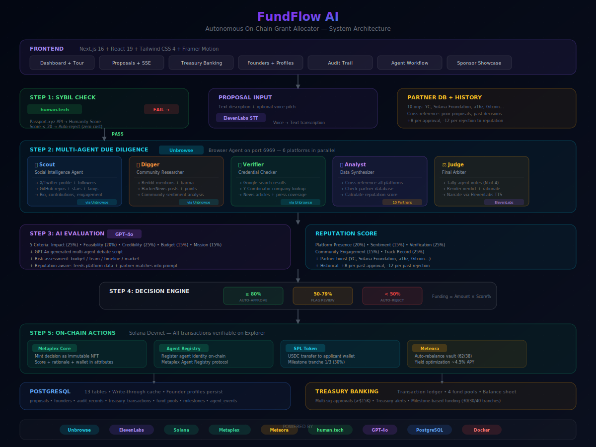

# FundFlow AI

**Autonomous On-Chain Grant Allocator with Multi-Agent Due Diligence on Solana**

> **New build** for the [Intelligence at the Frontier](https://intelligence-at-the-frontier-hackathon.devspot.app/) hackathon, March 14-15, 2026.

**Live Demo**: [fundflow.ayushojha.com](https://fundflow.ayushojha.com)
**GitHub**: [github.com/Ayush10/fundflow-ai](https://github.com/Ayush10/fundflow-ai)

---

## What Is FundFlow AI?

FundFlow AI is an autonomous treasury infrastructure where **5 AI agents collaboratively evaluate grant proposals**, verify founder identities, research applicant credentials across 6 web platforms, debate findings in real-time with voice narration, and execute USDC disbursements on Solana — all without human intervention.

Every decision is minted as an immutable **Metaplex Core NFT** on-chain. Idle treasury funds earn yield via **Meteora** dynamic vaults. The system includes a full banking-grade treasury with transaction ledger, fund allocation pools, milestone-based funding, and multi-sig approvals.

**This is not a dashboard or chatbot.** The agents take action: they vote on proposals, move funds, evaluate work, explain their reasoning aloud, and coordinate with each other before rendering a verdict.

---

## The Problem

Grant programs and DAOs face critical challenges:

1. **Manual review bottleneck** — Human reviewers can't keep up. Decisions take weeks and quality is inconsistent
2. **Sybil attacks** — Without identity verification, bad actors drain treasuries with fake proposals
3. **No due diligence** — Reviewers don't have time to research every applicant across GitHub, Twitter, LinkedIn, Reddit, HackerNews, and Y Combinator
4. **Idle capital** — Treasury funds sit earning nothing between disbursements
5. **No audit trail** — Decisions are made off-chain with no verifiable record

## The Solution

FundFlow AI replaces the entire manual pipeline with an autonomous agent council:

```
Proposal Submitted
       |
       v
[1. Human Passport Check] ──FAIL──> Reject (Sybil detected, no funds at risk)
       |
      PASS
       |
       v
[2. Multi-Agent Due Diligence] ── 5 agents, 6 platforms, parallel research
  |── Scout: X/Twitter + GitHub (Unbrowse browser agent)
  |── Digger: Reddit + HackerNews (Unbrowse browser agent)
  |── Verifier: Google + Y Combinator (Unbrowse browser agent)
  |── Analyst: Cross-references findings, checks partner DB + founder history
  |── Judge: Renders verdict after agents debate
       |
       v
[3. Agent Council Debate] ── GPT-4o generates natural multi-agent dialogue
  |── Agents discuss discoveries via ElevenLabs TTS (per-agent voices)
  |── Challenge, verify, agree on findings
  |── Vote: 80%+ council approval required
       |
       v
[4. Reputation Scoring] ── Composite score from:
  |── Platform presence (6 platforms)
  |── Sentiment analysis
  |── Verification confidence
  |── Community engagement (Reddit + HN)
  |── Track record (GitHub + YC + Google + partner DB + prior history)
       |
       v
[5. AI Evaluation (GPT-4o)] ── 5 weighted criteria + risk assessment
       |
       v
[6. Decision Engine]
  >= 80%: Auto-approve (proportional funding: amount * score/100)
  50-79%: Flag for human review
  < 50%:  Auto-reject with rationale
       |
       v
[7. On-Chain Actions]
  |── Mint Metaplex Core NFT (immutable decision record)
  |── Register agent identity in Metaplex Agent Registry
  |── Transfer USDC via SPL Token (milestone tranche 1/3)
  |── Auto-rebalance Meteora vault (62/38 liquid-to-vault ratio)
  |── Log to PostgreSQL + transaction ledger
  |── Update founder profile in database
  |── Narrate verdict via ElevenLabs TTS
```

---

## Architecture



<details>
<summary>Text version</summary>

```
Frontend (Next.js 16 + React 19 + Tailwind CSS 4)
  │ Dashboard │ Proposals │ Treasury │ Founders │ Audit │ Tour
  ▼
Step 1: Sybil Check ── human.tech Passport API ── FAIL → Reject
  │ PASS
  ▼
Step 2: Multi-Agent Due Diligence ── Unbrowse browser agent (port 6969)
  │ Scout (X + GitHub) │ Digger (Reddit + HN) │ Verifier (Google + YC)
  │ Analyst (cross-ref + partner DB) │ Judge (verdict + ElevenLabs TTS)
  ▼
Step 3: AI Evaluation ── GPT-4o (5 criteria + debate + risk assessment)
  │ + Reputation Score (platform presence + sentiment + community + track record)
  ▼
Step 4: Decision ── ≥80% approve (proportional) │ 50-79% flag │ <50% reject
  ▼
Step 5: On-Chain ── Metaplex Core NFT │ Agent Registry │ SPL USDC │ Meteora vault
  ▼
PostgreSQL (13 tables) + Treasury Banking (ledger + pools + milestones)
```

</details>

---

## Sponsor Integrations (6 Live)

Every sponsor technology is deeply integrated — not just imported, but core to the autonomous pipeline.

### Unbrowse — Browser Agent ($1,500 challenge)
**Novel use case: Autonomous due diligence via browser agent**
- Unbrowse CLI runs inside the Docker container with Chromium, serving on port 6969
- 5 AI agents make parallel `POST /resolve` calls with targeted extraction intents
- **6 platforms scraped concurrently**: X/Twitter, GitHub, Reddit, HackerNews, Google, Y Combinator
- Each platform gets a specialized intent prompt for structured JSON extraction
- Results feed directly into reputation scoring and the GPT-4o evaluation prompt
- Graceful fallback to deterministic profiles when Unbrowse is offline
- `src/lib/integrations/platforms.ts` — 6 platform-specific research functions
- `src/lib/integrations/unbrowse.ts` — Original 3-platform research (GitHub/LinkedIn/Twitter)

### Solana + Metaplex — On-Chain Agent ($5,000 challenge)
**Agent registration + immutable NFT audit trail + USDC disbursements**
- **Metaplex Agent Registry**: FundFlow AI agent registered as an on-chain identity via `registerIdentityV1`
- **Metaplex Core NFTs**: Every decision minted as a Core asset with attributes (score, rationale, timestamps, wallet, decision)
- **SPL Token transfers**: Real USDC disbursements from treasury to applicant wallets
- **Transaction hashes**: Every mint and transfer verifiable on Solana Explorer (devnet)
- Agent identity viewable on-chain at its registered asset address
- `src/lib/solana/agent-registry.ts` — Agent registration and identity management
- `src/lib/solana/metaplex.ts` — Core asset minting with decision attributes
- `src/lib/solana/treasury.ts` — USDC SPL token disbursement logic

### Meteora — DeFi Yield ($1,000 challenge)
**Autonomous treasury yield optimization**
- Idle USDC auto-deposited into Meteora dynamic vaults (~4.5% APY)
- 62% liquid / 38% vault target allocation maintained automatically
- $9,000 minimum liquid buffer enforced
- Auto-rebalance after every disbursement
- Yield accrual tracked in transaction ledger with daily entries
- Withdraw-on-demand when approved grants exceed liquid balance
- `src/lib/solana/meteora.ts` — Vault deposit/withdraw/rebalance logic

### ElevenLabs — Multi-Voice AI Narration
**5 distinct agent voices narrating discoveries in real-time**
- Each of the 5 agents has a unique ElevenLabs voice ID (Rachel, Antoni, Arnold, Adam, custom)
- Key discovery moments are narrated per-agent (Scout finds GitHub, Digger finds Reddit, etc.)
- Judge delivers the final verdict narration
- Voice pitch transcription (STT) for proposal submission
- Guided audio tour of the entire dashboard generated via ElevenLabs TTS
- `src/lib/voice/elevenlabs.ts` — TTS/STT + `narrateShort()` for agent clips

### human.tech (Passport) — Sybil Resistance
**Pre-screening that blocks bots before any capital is at risk**
- Gitcoin Passport API integration via human.tech with scorer ID
- Humanity score threshold (configurable, currently 20)
- Sybil wallets rejected BEFORE due diligence begins — zero cost
- Real passport verification on Solana devnet
- `src/lib/integrations/human-tech.ts` — Passport.xyz API integration

### OpenAI GPT-4o — AI Evaluation + Debate
**5-criteria scoring + natural multi-agent debate generation**
- Evaluates proposals across: Impact, Feasibility, Credibility, Budget, Mission
- Generates natural debate scripts between 5 agents based on research data
- Risk assessment: budget, team, timeline, market risk dimensions with flags
- Reputation-aware: feeds platform data and partner matches into the prompt
- `src/lib/agent/evaluator.ts` — Scoring engine with heuristic fallback
- `src/lib/agent/multi-agent.ts` — GPT-4o debate generation

---

## Key Features

### Multi-Agent Council
5 specialized AI agents (Scout, Digger, Verifier, Analyst, Judge) research, debate, and vote on every proposal. Each has a persona, role, and ElevenLabs voice. The conversation streams in real-time via SSE.

### Treasury Banking Infrastructure
Full banking-grade system: transaction ledger, 4 fund allocation pools (DeFi, Public Goods, Research, Community), balance sheet, treasury alerts (low balance, pool depletion), and multi-sig approvals for large disbursements (>$15K).

### Milestone-Based Funding
Approved grants are split into 3 tranches (30/30/40%). Tranche 1 auto-disburses. Tranches 2-3 require milestone verification by the agent council before release.

### Founder Profiles + Reputation Database
Every applicant gets a persistent founder profile stored in PostgreSQL. Platform presence, reputation score, proposal history, and funding track record persist across proposals and restarts. Prior rejections lower future reputation; prior approvals boost it.

### Partner Database
10 known-good organizations (Y Combinator, Solana Foundation, a16z, Gitcoin, Protocol Labs, etc.) with trust boost scores. Proposals mentioning partners get credibility boosts.

### Risk Assessment
4-dimension risk scoring (budget, team, timeline, market) with flags for large requests, missing milestones, urgency language, and unproven concepts.

### Guided Audio Tour
ElevenLabs-narrated tour of the entire dashboard with auto-scrolling highlights and subtitles. Synced to 8 dashboard sections, each labeled with its sponsor.

### Auto-Categorize into Fund Pools
Proposals are automatically classified into DeFi, Public Goods, Research, or Community pools based on keyword analysis. Pool budgets track allocation and depletion.

### PDF Due Diligence Reports
One-click downloadable PDF for every evaluated proposal: full scores, agent conversation, research data, decision rationale, on-chain transaction hashes.

### PostgreSQL Persistence
Write-through cache: reads from in-memory store, writes to both memory and PostgreSQL (13 tables). Founders, transactions, and audit records survive container restarts.

### Comments & Notes
Judges can annotate proposals with text notes. Comments persist and are visible in the proposal detail view.

### Activity Feed
Real-time feed of all system activity: proposals submitted, evaluations completed, disbursements made, milestones verified, comments added. Auto-refreshes every 8 seconds.

---

## Tech Stack

| Layer | Technology | Purpose |
|-------|-----------|---------|
| **Frontend** | Next.js 16, React 19, Tailwind CSS 4 | Dashboard, forms, real-time UI |
| **Animations** | Framer Motion | Page transitions, score animations, tour highlights |
| **AI Evaluation** | OpenAI GPT-4o | Proposal scoring, debate generation, risk assessment |
| **Multi-Agent** | Custom TypeScript orchestrator | 5-agent council with SSE event streaming |
| **Voice** | ElevenLabs API | 5-voice STT/TTS, guided tour narration |
| **Identity** | human.tech (Passport) | Sybil-resistant humanity verification |
| **Research** | Unbrowse | Browser agent, 6-platform web scraping |
| **Blockchain** | Solana Web3.js, SPL Token | Treasury management, USDC transfers |
| **NFT Audit** | Metaplex Core + Agent Registry | Immutable decision records, agent identity |
| **DeFi Yield** | Meteora | Dynamic vault yield optimization |
| **Database** | PostgreSQL | 13-table schema, write-through persistence |
| **Deployment** | Docker + Coolify | Bookworm-slim with Chromium for Unbrowse |

---

## API Endpoints (20+)

| Method | Endpoint | Description |
|--------|----------|-------------|
| `GET` | `/api/proposals` | List all proposals |
| `POST` | `/api/proposals` | Submit a new proposal |
| `GET` | `/api/proposals/[id]` | Get proposal with decision |
| `POST` | `/api/proposals/[id]/evaluate` | Trigger multi-agent evaluation |
| `GET` | `/api/proposals/[id]/stream` | SSE stream of agent events |
| `GET` | `/api/proposals/[id]/report` | Due diligence report (JSON for PDF) |
| `GET/POST` | `/api/proposals/[id]/comments` | Judge notes/comments |
| `GET/POST` | `/api/proposals/[id]/milestones` | Milestone tracking + verification |
| `GET` | `/api/treasury` | Treasury balance + vault state |
| `POST` | `/api/treasury/deposit` | Deposit to Meteora vault |
| `POST` | `/api/treasury/withdraw` | Withdraw from vault |
| `GET` | `/api/treasury/transactions` | Full transaction ledger |
| `GET` | `/api/treasury/pools` | Fund allocation pools |
| `GET` | `/api/treasury/alerts` | Treasury health alerts |
| `GET/POST` | `/api/treasury/approvals` | Multi-sig approval queue |
| `GET` | `/api/audit` | On-chain audit records |
| `GET` | `/api/audit/[assetAddress]` | Audit record by Metaplex asset |
| `GET` | `/api/founders` | All founder profiles |
| `GET` | `/api/founders/[wallet]` | Founder detail + proposal history |
| `GET/POST` | `/api/agent` | Agent registry (register/check) |
| `GET` | `/api/activity` | Live activity feed |
| `GET` | `/api/tour` | Guided tour audio + segments |
| `POST` | `/api/voice/transcribe` | Voice pitch STT |
| `POST` | `/api/voice/narrate` | Decision narration TTS |

---

## Demo Data

The system comes pre-populated with realistic data showcasing every feature:

- **8 founders**: YC-backed Sarah Chen (rep 92), Gitcoin veteran Priya Sharma (rep 89), ex-Paradigm James Liu (rep 78), ZK researcher Elena Kowalski (rep 72), community builder Dev Singh (rep 65), flagged Alex Rivera (rep 58), rejected Marcus Webb (rep 28), and a Sybil bot (rep 0)
- **7 proposals**: 2 approved, 2 rejected, 1 flagged, 2 pending
- **27 transactions**: Initial funding, daily yield accruals, tranche disbursements, auto-rebalances
- **5 on-chain audit records** with full scoring breakdowns
- **$230K total treasury assets**: $62K liquid, $165K in Meteora vault, $3K yield earned

---

## Challenge Submissions

### Metaplex Onchain Agent ($5,000)
FundFlow AI is a registered on-chain agent via the Metaplex Agent Registry. Every grant decision is minted as a Metaplex Core NFT with attributes storing score, rationale, timestamps, wallet addresses, and decision outcome. The agent identity, decision collection, and audit trail are all on-chain and verifiable on Solana Explorer.

### Agentic Funding & Coordination — Solana ($1,200)
This IS the track description: autonomous agents that coordinate resources, funding, and decision-making. 5 AI agents vote on proposals, move funds, evaluate work, explain their reasoning, and coordinate with each other. Not a dashboard — agents take real action.

### Unbrowse Challenge ($1,500)
Novel use case: autonomous due diligence. The Unbrowse browser agent runs inside the Docker container, scraping 6 platforms in parallel (X, GitHub, Reddit, HackerNews, Google, Y Combinator) with targeted extraction intents. This is structured data extraction feeding directly into the AI scoring pipeline — not just browsing, but acting.

### Meteora Challenge ($1,000)
Idle treasury USDC is auto-deposited into Meteora dynamic vaults. The agent manages yield autonomously: depositing excess funds, withdrawing for disbursements, maintaining a $9K liquid buffer, and rebalancing after every transaction. Yield accrual tracked in the transaction ledger.

---

## Getting Started

```bash
git clone https://github.com/Ayush10/fundflow-ai.git
cd fundflow-ai
npm install
cp .env.local.example .env.local
# Edit .env.local with your API keys
npm run dev
```

Every integration has an independent toggle. The demo works with zero API keys — all integrations fall back to deterministic simulations.

---

## Builder

**Ayush Ojha** — [ayushojha.com](https://ayushojha.com)

---

## License

MIT
